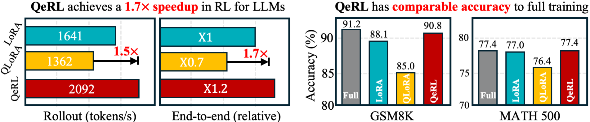
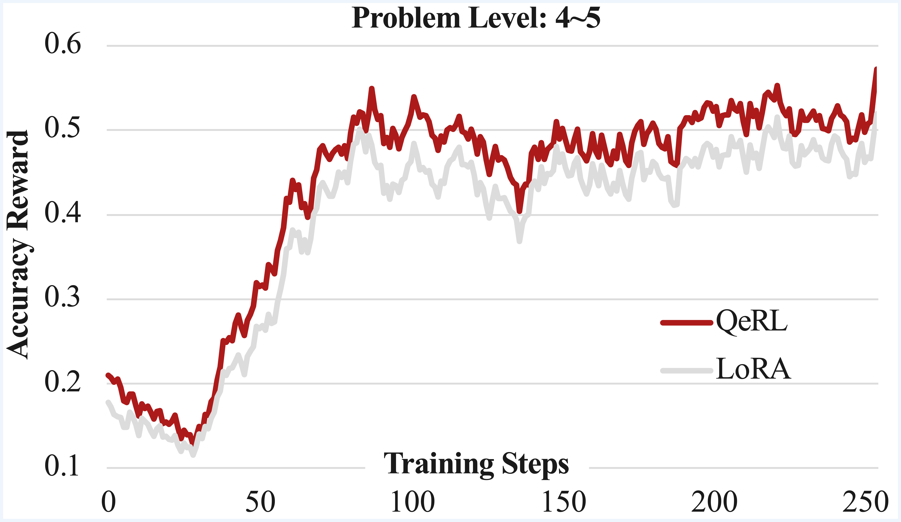

<p align="center" style="border-radius: 10px">
  
</p>

# 🚀 QeRL: Beyond Efficiency -- Quantization-enhanced Reinforcement Learning for LLMs

[](https://arxiv.org/abs/2510.11696)
[](https://github.com/NVlabs/QeRL)


[https://github.com/user-attachments/assets/3c9b5b04-0d44-4b68-a4af-059b3d834fc3](https://github.com/user-attachments/assets/3c9b5b04-0d44-4b68-a4af-059b3d834fc3)


## 💡 TLDR: QeRL supports RL for 32B LLMs on a single H100 GPU, maintaining full-parameter FT performance!

**QeRL: Beyond Efficiency -- Quantization-enhanced Reinforcement Learning for LLMs [[Paper](https://arxiv.org/abs/2510.11696)]** <br />

[Wei Huang](https://aaron-weihuang.com/), [Yi Ge](https://scholar.google.com/citations?user=wYXhPFQAAAAJ&hl=zh-CN), [Shuai Yang](https://andysonys.github.io/), [Yicheng Xiao](https://easonxiao-888.github.io/), [Huizi Mao](https://developer.nvidia.com/zh-cn/blog/author/huizi-mao/), [Yujun Lin](https://yujunlin.com/), [Hanrong Ye](https://research.nvidia.com/person/hanrong-ye), [Sifei Liu](https://sifeiliu.net/), [Ka Chun Cheung](https://scholar.google.com/citations?user=NvbCXToAAAAJ&hl=zh-TW), [Hongxu Yin](https://hongxu-yin.github.io/), [Yao Lu](https://scholar.google.com/citations?user=OI7zFmwAAAAJ&hl=en), [Xiaojuan Qi](https://scholar.google.com/citations?user=bGn0uacAAAAJ&hl=en), [Song Han](http://songhan.mit.edu/), [Yukang Chen](https://yukangchen.com/) <br />


We propose QeRL, a Quantization-enhanced Reinforcement Learning framework for large language models (LLMs). While RL is essential for LLMs' reasoning capabilities, it is resource-intensive, requiring substantial GPU memory and long rollout durations. QeRL addresses these issues by combining NVFP4 quantization with Low-Rank Adaptation (LoRA), accelerating rollout phase of RL while reducing memory overhead. Beyond efficiency, our findings show that quantization noise increases policy entropy, enhancing exploration, and enabling the discovery of better strategies during RL. To further optimize exploration, QeRL introduces an Adaptive Quantization Noise (AQN) mechanism, which dynamically adjusts noise during training. Experiments demonstrate that QeRL delivers over 1.5× speedup in the rollout phase. Moreover, this is the first framework to enable RL training of a 32B LLM on a single H100 80GB GPU, while delivering overall speedups for RL training. It also achieves faster reward growth and higher final accuracy than 16-bit LoRA and QLoRA, while matching the performance of full-parameter fine-tuning on mathematical benchmarks such as GSM8K (90.8%) and MATH 500 (77.4%) in the 7B model. These results establish QeRL as an efficient and effective framework for RL training in LLMs.

<p align="center" style="border-radius: 10px">
  
<strong>QeRL achieves faster RL rollout and end-to-end training speeds, while delivering performance superior to vanilla LoRA and QLoRA, also comparable to full-parameter RL on mathematical benchmarks.</strong>
</p>
<p align="center" style="border-radius: 10px">
  
<strong>Rollout throughput of Qwen2.5-14B/32B-Instruct models under different lora ranks.</strong>
</p>

## TABLE OF CONTENTS
1. [News](#news)
2. [Highlights](#highlights)
3. [Introduction](#introduction)
4. [Installation](#installation)
5. [Training](#training)
6. [Evaluation](#evaluation)
7. [How to contribute](#how-to-contribute)
8. [Citation](#citation)
9. [License](#license)
10. [Acknowledgement](#acknowledgement)

## News
- [x] [2025.10] We release [Paper](https://arxiv.org/abs/2510.11696), this GitHub repo [QeRL](https://github.com/NVlabs/QeRL) with all training and inference code.

## Highlights
1. **Low-cost reinforcement learning**: QeRL support 32B LLM training on single H100 80GB GPU.
2. **Fast rollout/sampling**: QeRL delivers over 1.5× speedup in the rollout phase, and gains more speedup in longer reasoning trace.
3. **Quantization helps reinforcement learning exploration**: Quantization noise increases policy entropy, enhancing exploration, and enabling the discovery of better strategies during RL.

## Introduction
<p align="center" style="border-radius: 10px">
  
<strong>Quantization noise brings higher initialized entropy, which encourages exploration in RL training, accelerating the increase of reward.</strong>
</p>
<p align="center" style="border-radius: 10px">
  
<strong>The framework of QeRL. QeRL utilize NVFP4 for low-cost and fast LoRA training with injected adaptive quantization noise.</strong>
</p>
<p align="center" style="border-radius: 10px">
  
<strong>In GRPO, quantized model delivers better converged reward score and faster reward growth.</strong>
</p>
<p align="center" style="border-radius: 10px">
  
<strong>Training reward of Qwen2.5-32B-Instruct model.</strong>
</p>


## Installation
**Requirements**

We tested this repo on the following setup:
* Nvidia GPU supports NVFP4 weight format with triton (e.g. RTX 5090, H100, B100...).
* Linux operating system.
* 64 GB RAM.

Other hardware setup could also work but hasn't been tested.

**Environment**

Create a conda environment and install dependencies:
```
git clone https://github.com/NVlabs/QeRL
cd QeRL
conda create -n qerl python=3.10 -y
conda activate qerl
conda install nvidia/label/cuda-12.4.1::cuda
conda install -c nvidia/label/cuda-12.4.1 cudatoolkit
sh setup_env.sh
```

## Training
**Create a new conda to quantize your own LLM with NVFP4**

Please follow the [instruction](llm-compressor/speed_tests/INSTRUCTION.md) in llmcompressor/instruction.md to buid the quantization tool.

```
cd llm-compressor
conda create -n llmcompressor python=3.12 -y
conda activate llmcompressor

pip install -e .
pip install nvidia-ml-py

python quantize_nvfp4.py --model Qwen/Qwen2.5-3B-Instruct
python quantize_nvfp4.py --model Qwen/Qwen2.5-7B-Instruct
python quantize_nvfp4.py --model Qwen/Qwen2.5-14B-Instruct
python quantize_nvfp4.py --model Qwen/Qwen2.5-32B-Instruct

```

**Training with QeRL**
```
bash training/dapo_qwen2.5-7b_nvfp4_single_gpu.sh
```
**Training with vanilla (16-bit) LoRA**
```
bash training/dapo_qwen2.5-7b_bf16_single_gpu.sh
```

**Hints for QeRL training**

1. Adjust GPU Memory Utilization for Efficient Training: 
You can set different values for the `--vllm-gpu-memory-utilization` parameter in your training script to control the memory usage on your GPUs. For QeRL, it is recommended to set this value smaller than usual since the model uses the NVFP4 format, which is optimized for reduced memory consumption. Lowering this value helps to better utilize memory resources without compromising training stability, especially on GPUs with limited memory capacity.

2. Optimize Batch Size and Gradient Accumulation: 
You can tune the parameters `--perdevice_train_batch_size` and `--gradient_accumulation_steps` to match your available hardware and target effective batch size. If GPU memory is limited, reduce `--perdevice_train_batch_size` and increase `--gradient_accumulation_steps` to reach the desired total batch size. Note that increasing `--gradient_accumulation_steps` **will slow end-to-end training compared to vanilla LoRA**. This is because prefill logits computation still requires dequantization (to be optimized in the future). Striking the right balance between these two parameters is crucial for efficient resource utilization and faster training.

3. Customize Noise Scale and Stages for Dataset-Specific Training: 
QeRL allows you to configure the noise scale parameters `sigma_start`, `sigma_end`, and `num_stages` to tailor the training process to your dataset. Adjusting the noise scale can significantly impact the training dynamics and the quality of the model`s learning. It is recommended to run a few trials with different configurations to determine the optimal settings for your specific dataset.

4. Increase Learning Rate (lr) for Quantized Models:
We found that the optimal learning rate (lr) for QeRL is roughly 10× higher than that used for vanilla LoRA in the same application. This mirrors and extends [Thinking Machines](https://thinkingmachines.ai/blog/lora/#:~:text=Our%20experiments%20showed%20that%20the%20optimal%20LR%20for%20LoRA%20is%20consistently%2010x%20the%20one%20used%20for%20FullFT%20in%20the%20same%20application%2C%20for%20both%20supervised%20learning%20and)’ finding that the optimal LoRA LR is consistently about 10× that of FullFT. In QeRL on quantized models, you can safely use a learning rate an order of magnitude higher (about 1e-5 to 3e-5 in our experiments). This accelerates reward improvement, improves training efficiency, and yields more stable RL. In contrast, for 16-bit models, pushing the LR too high—even with LoRA—can cause instability.


## Evaluation
**Evaluate on GSM8K/AMC 23**

```
# For base model without reasoning RL, we use lm-eval to evaluate the GSM8K score.

pip install lm-eval

lm_eval --model hf \
    --model_args pretrained=$MODEL_PATH,dtype="float" \
    --tasks gsm8k \
    --device cuda:0 \
    --batch_size 8

# For model trained by QeRL, we give the evaluation code based on vLLM engine.
python -m eval.gsm8k --model $MODEL_PATH --load nvfp4

```

**Evaluate on Other benchmarks**
```
# For base model without reasoning RL, we use lighteval to evaluate the metrics.

export VLLM_WORKER_MULTIPROC_METHOD=spawn
export VLLM_DISABLE_COMPILE_CACHE=1
NUM_GPUS=8 # Set to 8 for 32B and 70B models

MODEL=$MODEL_PATH
MODEL_ARGS="model_name=$MODEL,dtype=bfloat16,max_model_length=6144,gpu_memory_utilization=0.8,tensor_parallel_size=$NUM_GPUS,generation_parameters={max_new_tokens:8192,temperature:0.6,top_p:0.95}"
OUTPUT_DIR=evals/$MODEL

TASK=aime24
lighteval vllm $MODEL_ARGS "lighteval|$TASK|0|0" \
    --use-chat-template \
    --output-dir $OUTPUT_DIR
TASK=aime25
lighteval vllm $MODEL_ARGS "lighteval|$TASK|0|0" \
    --use-chat-template \
    --output-dir $OUTPUT_DIR

TASK=math_500
lighteval vllm $MODEL_ARGS "lighteval|$TASK|0|0" \
    --use-chat-template \
    --output-dir $OUTPUT_DIR

```

## How to contribute
- Make sure to have git installed.
- Create your own [fork](https://github.com/NVlabs/QeRL/fork) of the project.
- Clone the repository on your local machine, using git clone and pasting the url of this project.
- Read both the `Requirements` and `Installation and Quick Guide` sections below.
- Commit and push your changes.
- Make a pull request when finished modifying the project.


## Citation
Please consider to cite our paper and this framework, if they are helpful in your research.
```bibtex
@article{huang2025qerl,
      title={QeRL: Beyond Efficiency -- Quantization-enhanced Reinforcement Learning for LLMs}, 
      author={Wei Huang and Yi Ge and Shuai Yang and Yicheng Xiao and Huizi Mao and Yujun Lin and Hanrong Ye and Sifei Liu and Ka Chun Cheung and Hongxu Yin and Yao Lu and Xiaojuan Qi and Song Han and Yukang Chen}
      year={2025},
      eprint={2510.11696},
      archivePrefix={arXiv},
      primaryClass={cs.LG}
}
```

## License
- QeRL code is under Apache 2.0 License.

## Acknowledgement
- [vLLM](https://github.com/vllm-project/vllm): the inference and rollout backend is supported by vLLM.
- [llm-compressor](https://github.com/vllm-project/llm-compressor): the quantization of NVFP4 is built on llm-compressor.
- [trl](https://github.com/huggingface/trl): our reinforcement learning training framework is built on trl.
- [open-r1](https://github.com/huggingface/open-r1): our reasoning training recipes are based on open-r1.
- [Marlin](https://github.com/IST-DASLab/marlin): the inference kernel of NVFP4×BF16 is supported by Marlin kernel.


